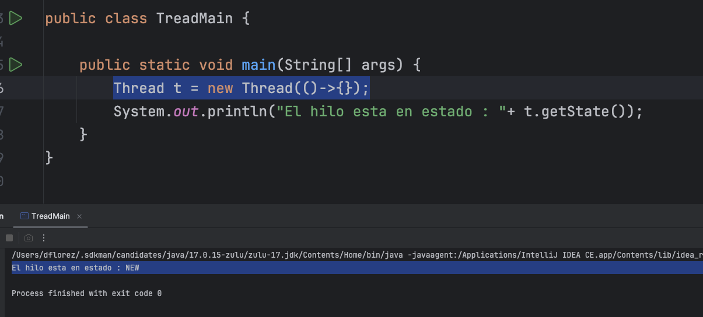
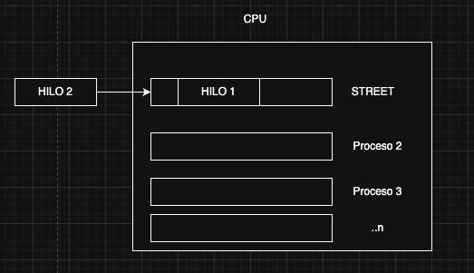

Hilos 

¿Que es un Hilo?

Los hilos vienen de java.lang.tread.*

Un hilo (Tread) es un ejecucion de un proceso que ocurre en segundo plano("Asincrono")
podemos ejcutar multiples proces ejecutados en paralos y preguntar su estado

Un recurso propio de la maquina que se le asigna un proceso..
Comunicacion de forma asincrona con un proceso

Porque usar un Hilo ?

Para ejecutar tareas o multiples tareas en simultaneo 
Mejorar el rendimientos de muchas operaciones sin estar atado al sincronizmo
Se puede manteneder una GUI (interfaz grafica mas resposiva)

CICLO DE VIDA DE UN HILO

Un Hilo pasa por distintos estados  en el proceso, la  clase que me ayuda a mi a ver el estado
de un Hilo que es el metodo getState() =>  java.lang.tread.State;

El Hilo puede pasar por al rededor de 8 estados

NEW, RINNABLE -> RUNNING -> WAITING -> TIME_WAITING-> BLOCK-> TERMINATED

**Estado NEW**

El estado cuando se ha creado un Hilo pero aun no ha comenzado ...solo creado

Thread t = new Thread(()->{});
System.out.println("El hilo esta en estado : "+ t.getState());

Estado Runnable 

El Hilo esta listo para iniciar o esta listo para ser ejecutado y usar la CPU

**ESTADO RUNNING**
El hilo se esta Ejecutand o esta en tiempo de ejecucion

**BOCKED**
EL hilo intenta Acceder a un recurso sincronizado  que ya esta siendo usado por otro hilo

Intenta ingresar a un proceso que ya esta designado o ocupado

**CASOS DE BLOQUEO**

En el ejemplo , dos hilos estan tratando entrar al mismo proceso 
el cual fue definido con el synchronized que usan el mismo objeto lock/Street

1) thread1 entra primero a *Street* y ocupa el proceso
2) thread2  intenta entrar y se bloquea ya que esta ocupado la *Street*

**TIMED_WAITING**

El timed_waiting espera por un tiempo determinado para ejecutar su proceso  
timed_waiting se encunetra en pausa o espera para ser ejecutado (SLEEP)

´´´
package hilos.jthread.read;

public class TreadMain {

    private static final Object street = new Object();//lock
    private static final Object street2 = new Object();

    public static void main(String[] args) throws InterruptedException {
        System.out.println(street);
       /// System.out.println(street2);

        Thread thread1 = new Thread(()->{
            System.out.println("Inicio thread1");
            synchronized (street){
                try {
                    Thread.sleep(4000);
                    //while (true);
                } catch (InterruptedException e) {
                    throw new RuntimeException(e);
                }
               // System.out.println("Termina thread1 y libera el lock - proceso");
            }
        });

        Thread thread2 = new Thread(()->{
            System.out.println("Inicio thread2");
            synchronized (street){
                try {
                    Thread.sleep(1000);
                   // while (true);
                } catch (InterruptedException e) {
                    throw new RuntimeException(e);
                }
                //System.out.println("Termina thread2 y libera el lock - proceso");
            }
        });

        System.out.println("Estado hilo1 "  + thread1.getState());
        System.out.println("Estado hilo2 "  + thread2.getState());

        thread1.start();
        thread2.start();
        while (true){

            System.out.println("*********************");
            System.out.println("Estado hilo1 "  + thread1.getState());
            System.out.println("Estado hilo2 "  + thread2.getState());
            System.out.println("*********************");
            Thread.sleep(1000);
        }

    }
}
´´´

***ESTADO WATING***
El hilo esta esperando indefinidamente que se le notifique para contuar

PAra esto se usa el wait() , notify() , join()

***TERMINATED***

El estado Terminated indica el que el hilo acabo su proceso
Yaa no se esta ejecutando en memoria

´´´Java
public class TeadMain {
public static void main(String[] args) throws InterruptedException {
Thread hilo = new Thread(()-> System.out.println("show Aulamatriz"));

        System.out.println("El estado del hilo es " + hilo.getState());
        hilo.start();
        Thread.sleep(1000);
        System.out.println("El estado del hilo es " + hilo.getState());
    }
}
´´´

***LOCK***
En la concurrencia el lock(candado) es una fomra de asegururar
que los hiloz se ejcuten 1 a la vez en un proceso especifico

Porque usar el lock

Para controlar el flujo a a un proceso...

Ejemplo
Tenemos que escribir en un archivo plano o un log unformacion ...
Si muchos procesos entran al tiempo se puede bloquear la db , el archivo por la concurrencia

Lock me ayuda a organizar mi proceso

Interaccion la DB 
Proceso que haga multiples operaciones
SELECT , INSERT, UPDATE
HILO que realice el proceso del correo de forma asincrona..

EMIAL
BUSCAR informacion del usuario
INSERTAR el envio de la carta
CONSULTAR la recepcion de la carta
UPDATE el estado de la carta

*******
synchronized -> Evita que los hilos entren al mismo tiempo  -> Sincroniza los hilos o proceso
lock -> adminsira el acceso de los hilos
wait -> hace que el hilo espere (eternamiente) hasta que lo invoquen
NOtify-> Despierta o notifica al hilo que esta en espera para que continue
Join->  Hace que los hilos se encolen o esperen que termine uno para poder iniciar el otro

 

